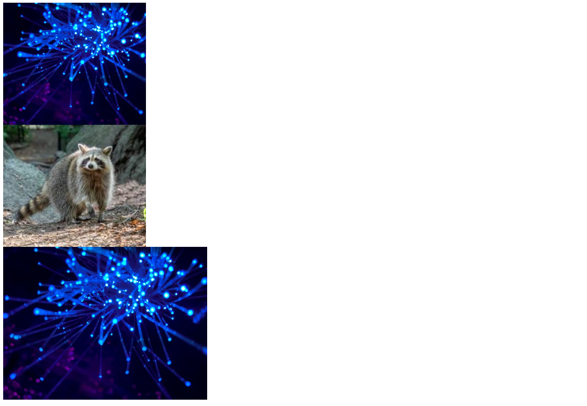

# IMMAGINI 
## Esercizi in HTML e CSS sulle Immagini
*Novembre 2025*
🧑‍💻

---




🔨
| Nome | Linguaggio |    Versione      |
|------|------------|------------------|      
| Html | Markup     | 5                |
| Css  | Style      | 4                |
      


👨‍💻
```bash
Avviare Golive da VS-Code
